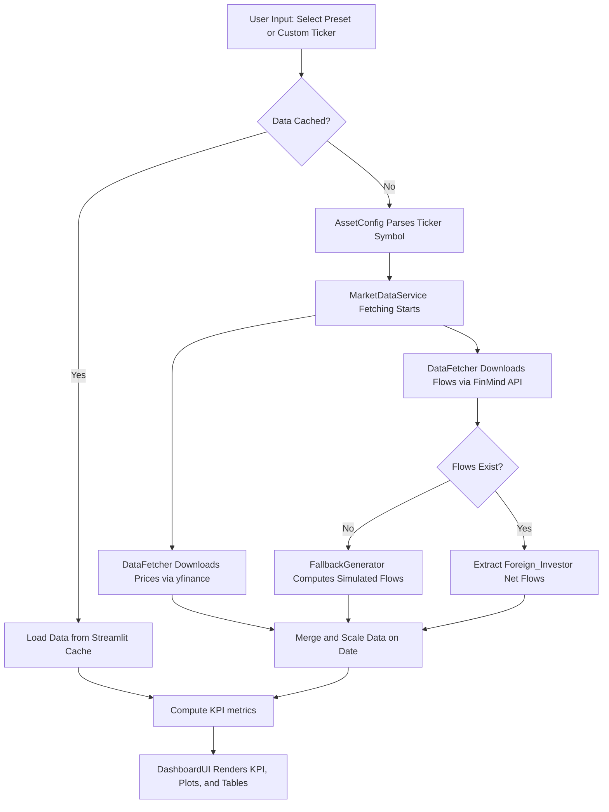

# Taiwan Stock & Foreign Institutional Tracker 專案文件

本文件詳細說明本專案重構後的物件導向設計（OOD）架構、技術棧、執行流程以及模組劃分。

---

## 1. 專案概述 (Project Overview)

- **專案名稱 (Project Name):** Taiwan Stock & Foreign Institutional Tracker
- **功能描述 (Description):** 一個模組化、低耦合、高內聚的互動式財經數據儀表板。它能自動獲取台灣股市加權指數（TAIEX）及特定或自訂個股（例如台積電、鴻海等）在過去 6 個月內的每日收盤價，並與外資法人（Foreign Institutional Investors）的每日淨買賣超進行交叉比對與視覺化呈現。
- **系統能力 (Capabilities):**
  - **模組化架構**：將資料獲取邏輯（Data Services）與介面呈現邏輯（UI Presentation）徹底分離。
  - **動態自訂個股支援**：使用者不僅能點選預設的權值股，亦能手動輸入自訂的台灣股票代碼（如 `2303`、`2409.TW`），系統會自動將輸入符號標準化為適用於 `yfinance` 的格式與 `FinMind API` 的格式。
  - **自動化時間區間計算**：從執行當日自動向前回推整整 6 個月，且具備處理閏年與月底天數溢出的容錯處理。
  - **高可用性防禦機制 (API Rate-Limit Fallback)**：當 FinMind API 達到存取上限或服務中斷時，系統能自動啟用模擬生成器，產出與價格走勢具備合理相關性的外資流向數據，防止儀表板崩潰。
  - **數據快取 (Caching)**：內建 1 小時快取機制（`st.cache_data`），節省 API 呼叫額度並提高頁面互動回應速度。

---

## 2. 物件導向設計與技術棧 (OOD & Tech Stack)

本專案採用高凝聚的類別（Classes）來劃分職責，達成低耦合的設計目標。程式碼拆分為 `data_service.py`（業務邏輯層）與 `app.py`（使用者介面層）。

### 業務邏輯與資料層 (`data_service.py`)

- **`AssetConfig`**:
  - **職責**：封裝目標資產的所有屬性配置（如代碼、顯示名稱、價格單位、成交量單位、是否為大盤指數等）。
  - **動態解析**：包含工廠方法 `from_ticker`，會根據輸入內容（如判斷是否為 `^TWII`、是否為全數字代碼）自動生成正確的 Ticker 與 FinMind ID。
- **`DataFetcher`**:
  - **職責**：無狀態（Stateless）類別，專門負責底層數據源的抓取。
  - **功能**：包含下載 `yfinance` 股價數據的 `fetch_prices` 方法與呼叫 FinMind 取得法人流向的 `fetch_foreign_flows` 方法。
- **`FallbackGenerator`**:
  - **職責**：無狀態類別，專門負責模擬數據生成。
  - **功能**：當外部 API 達到流量上限時，呼叫 `generate_mock_flows` 以股價回報率為基準加上隨機雜訊，生成高真實度的外資買賣超流量。
- **`MarketDataService`**:
  - **職責**：資料整合的核心協調器（Coordinator）。
  - **功能**：呼叫 `DataFetcher` 獲取價格與籌碼流向，若偵測到籌碼流向為空，則啟用 `FallbackGenerator` 生成模擬資料。最後進行時間對齊（Date Merging）並依據資產類別進行單位縮放（Index 為十億元，個股為百萬股）。

### 介面與控制層 (`app.py`)

- **`DashboardUI`**:
  - **職責**：控制儀表板的主畫面配置與生命週期。
  - **功能**：
    - `render_sidebar` 收集使用者控制參數並處理自訂代碼輸入。
    - `apply_custom_styles` 注入 Outfit Google Font 與卡片 CSS 樣式。
    - `render_kpi_cards`、`render_plotly_charts` 與 `render_data_table` 分別渲染 KPI 指標卡、Plotly 子圖及明細數據。
    - `run` 驅動整個應用程式的流轉。

---

## 3. 系統工作流與執行流程 (Workflow & Execution Flow)

### 執行流程說明 (Workflow Steps)
1. **使用者觸發 (User Trigger)**：使用者於 `DashboardUI` 側邊欄（Sidebar）進行選擇。若選取 "Custom Ticker..." 並輸入代碼，UI 將此值傳給後端。
2. **快取調用 (Cache Check)**：呼叫 `load_market_data` 頂層包裝函數，Streamlit 會檢查該參數的快取是否已存在。
3. **動態配置解析 (Asset Infras)**：`AssetConfig.from_ticker` 解析使用者輸入：
   - 輸入 `^TWII` -> 設定為大盤指數（單位：十億元 NTD）。
   - 輸入 `2303` -> 標準化為 `2303.TW`（單位：百萬股）。
4. **數據統籌 (Service Orchestration)**：`MarketDataService` 發起數據獲取請求：
   - 呼叫 `DataFetcher.fetch_prices` 取回日 K 線數據，並自動扁平化 yfinance 的 MultiIndex 欄位。
   - 呼叫 `DataFetcher.fetch_foreign_flows` 取回籌碼數據，並篩選外資 `Foreign_Investor` 淨流量。
   - **Fallback 觸發**：若 FinMind 返回空數據，則啟用 `FallbackGenerator.generate_mock_flows` 提供回報率相關性的模擬買賣超數據。
5. **合併與縮放 (Merging & Scaling)**：將兩者於 `Date` 欄位對齊，並依指數/個股乘上相應的縮放因子（10^9 或 10^6）。
6. **頁面繪製 (Visual Rendering)**：
   - 繪製 3 張 KPI Cards。
   - 繪製 Plotly 雙子圖（上半部為價格 Candlestick/Line，下半部為外資淨流入 Bar）。
   - 渲染交易明細表格與 CSV 導出按鈕。

### 流程圖 (Flowchart)



---

## 4. 專案目錄結構 (Project Structure)

專案結構劃分如下，完全隱藏了本地絕對路徑：

```
/path/to/project/python_TW_Stock_Foreign_Tracker/
├── .antigravity/                  # Antigravity IDE 專用 Prompt 設定檔
│   ├── system.prompt
│   └── documentation.prompt       # 本文件產生指令 prompt
├── app.py                         # UI 展現層 (DashboardUI 類別)
├── data_service.py                # 業務邏輯與資料服務層 (資料與運算類別)
├── requirements.txt               # 專案 Python 套件依賴清單
├── README.md                      # 使用者操作手冊
└── documentation.md               # 本架構文件
```

---

## 5. 配置與環境變數 (Configuration)

本專案主要包含以下控制參數：

- **FinMind API Token (可選設定):**
  - **參數位置:** 於網頁左側 Sidebar 的 `FinMind API Token` 欄位輸入。
  - **說明:** 未輸入時，系統使用公用 API 額度（每小時約 300 次請求限制）；若欲避免 API 被限制，可免費至 FinMind 官網註冊並填入 Token，額度會提升至每小時 600 次。
- **快取快照時間 (Cache TTL):**
  - 程式中寫定快取生存時間為 `3600` 秒（1 小時），避免在同一小時內對同一股票重複請求相同日期的資料。
- **自訂輸入符號標準化 (Input Normalization):**
  - 專案內部無硬編碼（hardcoded）路徑或特定伺服器 IP，輸入任何數值型代碼會自動補全 `.TW` 以支援台股。
